  

  Software, Robotics and AI Engineering student

  <a href="https://www.linkedin.com/in/nonso-nkire-1578122a7/">
    
    LinkedIn
  </a>
  &nbsp;&nbsp;&nbsp;
  <a href="https://www.nonso.software/">
    
    Portfolio
  </a>

## About

I'm a software engineering, robotics and AI student at QUT with an interest in systems, backend development, and applied AI.

I focus on building software where core engineering principles like concurrency, performance, and architecture matter, instead of boring surface level interfaces.

## Work

Currently working on an **AI Developer Profile Analyser**, a **Gravity Simulation**, and an **Embedded Control System EV project**.

## Featured Projects

- **Gravity Simulation**  
  A real-time 2D gravity simulation written in C using SDL2, focused on physically meaningful orbital motion, collision handling, and tracking of energy, momentum, angular momentum, and numerical drift.

- **Peer Practice Manager**  
  A Java-based application for organising and managing structured peer practice sessions, focused on improving consistency and collaboration.

- **Elevator Control System**  
  A multi-elevator simulation in C using POSIX threads, shared memory, and TCP communication.

- **Movie Application**  
  A full-stack React application with API integration for search and data visualisation.

## Stack

  

## Education

- *Bachelor of Engineering (Honours), Computer and Software Systems (2024 – 2027)*  
  **Grade Point Average:** Distinction (6.25)

- *Master of Robotics and Artificial Intelligence (2028)*  
  **Grade Point Average:** N/A

- *Queensland Certificate of Education*  
  **ATAR:** 94.7 / 99.95

## Metrics

  

